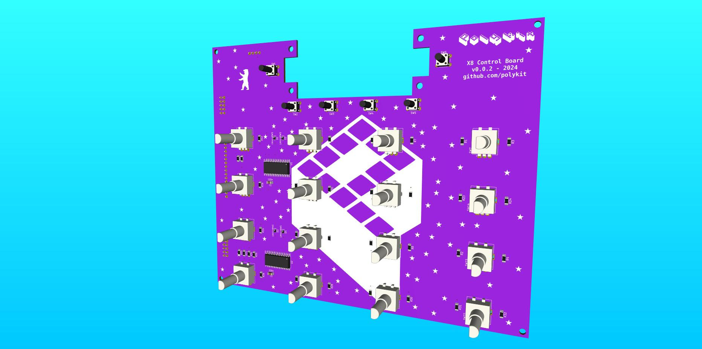

# Polykit X8 Controlboard

_THIS IS NOT A FINISHED PRODUCT IN ANY WAY AND STILL UNDER HEAVY DEVELOPMENT - USE AT YOUR OWN RISK!_

This repository contains Kicad schematics and PCB layout of a control board for a polyphonic synthesizer.

Related repositories:

* Voice Card: https://github.com/polykit/polykit-x-voice-card
* Main Board: https://github.com/polykit/polykit-x-mainboard
* Input Board: _soon_
* Software: _soon_
* Power Supply: https://github.com/polykit/eurorack-psu

## BOM
|Reference|Value         |Footprint                                                      |Comment                               |Qty|
|---------|--------------|---------------------------------------------------------------|--------------------------------------|---|
|C1, C2   |100n          |Capacitor_SMD:C_1206_3216Metric                                |                                      |2  |
|D1-D4    |1N4148WS      |Diode_SMD:D_SOD-323                                            |                                      |4  |
|J1       |MCU_BOARD     |Connector_PinHeader_2.54mm:PinHeader_1x16_P2.54mm_Vertical     |optional, when used as MIDI controller|1  |
|J2       |X8_I2C_POWER  |Connector_IDC:IDC-Header_2x05_P2.54mm_Vertical                 |                                      |1  |
|J3       |X8_EXT_DIGITAL|Connector_IDC:IDC-Header_2x05_P2.54mm_Vertical                 |                                      |1  |
|J4       |DISPLAY       |Connector_PinHeader_2.54mm:PinHeader_1x04_P2.54mm_Vertical     |                                      |1  |
|R1-R34   |10k           |Resistor_SMD:R_1206_3216Metric_Pad1.30x1.75mm_HandSolder       |                                      |34 |
|SW1-SW6  |SW_Push       |Button_Switch_THT:SW_PUSH_6mm_H13mm                            |                                      |6  |
|SW7-SW22 |RotaryEncoder |Rotary_Encoder:RotaryEncoder_Bourns_Vertical_PEC12R-3xxxF-Nxxxx|without switch                        |16 |
|U1, U2   |MCP23017_SO   |Package_SO:SOIC-28W_7.5x17.9mm_P1.27mm                         |                                      |2  |

## References

https://www.ti.com/lit/an/slva704/slva704.pdf
https://github.com/horfee/kicad-packages3D/tree/master/Rotary_Encoder.3dshapes
