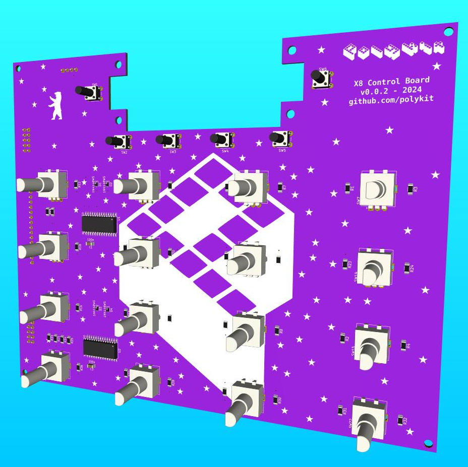

# Polykit X8 Controlboard

_THIS IS NOT A FINISHED PRODUCT IN ANY WAY AND STILL UNDER HEAVY DEVELOPMENT - USE AT YOUR OWN RISK!_

This repository contains Kicad schematics and PCB layout of a control board for a polyphonic synthesizer.

Related repositories:

* Voice Card: https://github.com/polykit/polykit-x-voice-card
* Main Board: https://github.com/polykit/polykit-x-mainboard
* Input Board: _soon_
* Software: _soon_
* Power Supply: https://github.com/polykit/eurorack-psu
